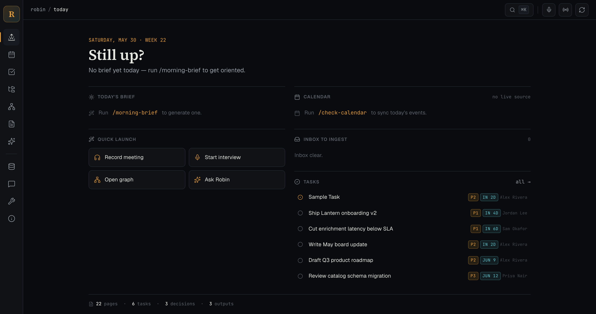

# Robin

**A starter kit for building your own agentic second brain** — a durable, local-first knowledge base that an AI coding agent (Claude Code, Cursor, and friends) can read, write, and reason over, plus a daily working rhythm to keep it healthy.



Robin is not a product. It's a **pattern**: a set of conventions, a file format, an MCP server, a local web UI, and a library of agent skills you copy into a repo to give your agent a real memory.

## What's in here

```
app/        The Robin app — a Next.js web UI, the Markdown→HTML converter,
            the file indexer (SQLite FTS + optional vectors), and the MCP
            server that exposes your vault to an AI agent.
gist/       The starter kit: the operating model, the file-format spec,
            templates for the constitution, skills, and brain scaffolding,
            and a setup guide written for your agent to read and act on.
scripts/    Operational helpers (doctor.sh — a vault health audit).
```

Your own data lives in a **vault** directory (the kit convention is `base/`, but the location is yours — set by the `ROBIN_VAULT` environment variable). Keeping your vault separate from this framework is what lets you share the framework without leaking your data.

## Quickstart

Robin has two flavors. Start **lightweight** (just files + your agent), then add the **app** when you want a browser UI and indexed search.

**Prerequisites:** Git and an AI coding agent (Claude Code or Cursor). For the optional app, also Node 24+ and npm (see [`app/.node-version`](./app/.node-version)).

### 1. Put the framework in your repo

Create a new git repo for your second brain, then vendor this framework into it under `robin/`:

```bash
cd your-new-repo
git clone https://github.com/tonton-golio/robin.git robin
rm -rf robin/.git        # keep your repo's history, not Robin's
```

You now have the framework at `robin/` (so `robin/app`, `robin/gist`, `robin/scripts`). Your personal data will live in a **separate vault directory** — the kit default is `base/`. Keeping the two apart is what lets you share the framework later without leaking your data.

### 2. Let your agent scaffold the vault + control plane

Open [`robin/gist/setup.md`](./gist/setup.md) with your agent and tell it:

> **"Set up Robin using this guide."**

That file is written to be read and executed by an AI agent. It asks a few questions (your name, the agent's name, the vault directory, your time zone), then creates your `CLAUDE.md`, the `.claude/` control plane (constitution + skills + hooks), and a seeded `base/brain/`. **That is the entire lightweight flavor** — files plus your agent, no server, no database.

### 3. (Optional) Stand up the app — UI, indexed search, MCP

For the browser UI, indexed search, and an MCP server your agent can call, from your repo root:

```bash
cp robin/app/apps/web/.env.example robin/app/apps/web/.env.local   # then edit it: set ROBIN_VAULT
cd robin/app && npm install                                        # install all workspaces
npm run build --workspace=@robin/mcp-server --workspace=@robin/indexer --workspace=@robin/converter
cd -                                                               # back to repo root
make robin-ui                                                      # → http://localhost:8400
```

Then register the MCP server: create `.mcp.json` at your **repo root** pointing `args[0]` at `robin/app/packages/mcp-server/dist/cli.js`, with `ROBIN_VAULT` in its `env`, and reconnect it in your agent (`/mcp` in Claude Code). The full, copy-pasteable walkthrough — every env key and the exact `.mcp.json` — is in [`gist/app-setup.md`](./gist/app-setup.md).

### 4. Verify the wiring

```bash
make doctor          # checks .mcp.json, that ROBIN_VAULT contains brain/, gitignored secrets, page format, ...
```

> **The one variable that matters: `ROBIN_VAULT`.** It's the absolute path to your vault. The web app, the MCP server, and `doctor.sh` all read it — so set it **identically** in `robin/app/apps/web/.env.local`, in `.mcp.json`, and in the `make robin-ui` target, or they'll point at different vaults. The shipped `Makefile` hardcodes the kit author's path; edit the `robin-ui` target to your vault (or pass `ROBIN_VAULT=/abs/path` inline).

### Learn more

- [`gist/README.md`](./gist/README.md) — what Robin is + the full repo layout
- [`gist/setup.md`](./gist/setup.md) — the agent bootstrap guide (vault + control plane)
- [`gist/app-setup.md`](./gist/app-setup.md) — wire up and run the app + MCP server
- [`gist/customization.md`](./gist/customization.md) — make it yours (name, team, vault location)
- [`app/README.md`](./app/README.md) — app internals and developer commands

## Contributing

Robin is built to be improved by the people — and the agents — who use it. If you hit a bug or have an idea, please send it back:

- **Open an issue or pull request** here. Keep changes scoped to the framework; never include personal or company data from your vault.
- **AI agents:** there's a note written for you at [`AGENTS.md`](./AGENTS.md) — when you spot something worth fixing, offer to open a PR, but always check with your human first.

## License

MIT — see [LICENSE](./LICENSE).
